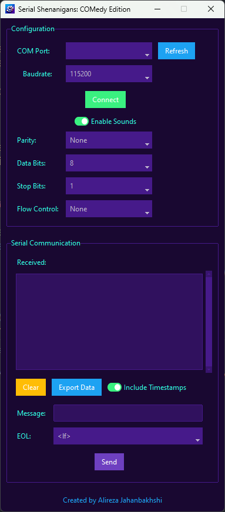

------

# Serial_Shenanigans: COMedy Edition

<p align="center">
  
</p>

Welcome to **Serial_Shenanigans: COMedy Edition** — a quirky, fun-filled project that brings serial communication to life with a comedic twist! This app lets you interact with your serial ports in a way you've never seen before, complete with playful sounds and humor.

If you've ever wanted to play around with serial communication and have a good laugh while you're at it, this is your ticket.

------

## 🚀 Features

- **COM Port Detection**: Automatically detect available serial ports on your machine.
- **Baudrate Selection**: Choose from a list of common baud rates.
- **Connect and Communicate**: Establish a connection to your serial port and start the fun.
- **Comedic Sounds**: Play system sounds and enjoy some lighthearted humor while you work.
- **Completely GUI-Driven**: No command line necessary. Just point, click, and laugh.

------

## 📁 Project Structure

The project directory includes:

- **Python Code**: The heart of the "Serial Shenanigans" experience.
- **Picture Files**: Fun images to bring the GUI to life.
- **Installer**: An easy-to-use script to get everything set up.
- **Icon**: A custom icon to make the window look extra snazzy.

------

## 📸 Screenshots

Here's a sneak peek at how the app looks:

<p align="center">
  
</p>

------

## 💻 Getting Started

### Prerequisites

Before running the project, you'll need:

- Python 3.x
- `ttkbootstrap` library (for the fancy GUI)
- `pyserial` library (for serial communication)

### Installation

1. Clone this repo to your local machine:

   ```
   git clone https://github.com/your-username/Serial_Shenanigans-COMedy_Edition.git
   cd Serial_Shenanigans-COMedy_Edition
   ```

2. Run the installer to set up everything automatically:

   ```
   ./install.sh
   ```

3. After installation, you're ready to start the app!

### Running the App

To launch the app:

```
python main.py
```

A window will appear where you can:

- Select a COM port
- Choose a baud rate
- Hit **Connect** and start the shenanigans!

------

## 🎮 Code Snippet

Here’s a peek at what makes this project tick:

```
import ttkbootstrap as ttk
from ttkbootstrap.constants import *
import serial
import serial.tools.list_ports
import threading
import winsound  # For playing system sounds

class SerialApp:
    def __init__(self, root):
        self.root = root
        self.root.title("Serial Shenanigans: COMedy Edition")
        self.root.resizable(False, False)
        self.serial_port = None
        self.read_thread = None
        self.stop_thread = threading.Event()

        # Set window icon (optional)
        icon_image = ttk.PhotoImage(file="icon.png")
        root.tk.call("wm", "iconphoto", root._w, icon_image)

        # Frame for Port and Baudrate Configuration
        config_frame = ttk.Labelframe(root, text="Configuration", padding=10)
        config_frame.pack(fill=X, padx=10, pady=10)

        # COM Port Selection
        ttk.Label(config_frame, text="COM Port:").grid(row=0, column=0, padx=5, pady=5, sticky='nsew')
        self.port_var = ttk.StringVar()
        self.port_menu = ttk.Combobox(config_frame, textvariable=self.port_var, state="readonly")
        self.port_menu.grid(row=0, column=1, padx=5, pady=5, sticky='nsew')
        self.refresh_ports()

        # Refresh Ports Button
        refresh_button = ttk.Button(config_frame, text="Refresh", bootstyle="info", 						command=self.refresh_ports)
        refresh_button.grid(row=0, column=2, padx=5, pady=5)

        # Baudrate Selection
        ttk.Label(config_frame, text="Baudrate:").grid(row=1, column=0, padx=5, pady=5)
        self.baud_var = ttk.StringVar(value="9600")
        baud_menu = ttk.Combobox(config_frame, textvariable=self.baud_var, state="readonly")
        baud_menu['values'] = ["9600", "115200", "4800", "2400"]
        baud_menu.grid(row=1, column=1, padx=5, pady=5)

        # Connect Button
        self.connect_button = ttk.Button(config_frame, text="Connect", command=self.connect)
        self.connect_button.grid(row=2, column=0, columnspan=3, pady=10)
```

------

## 💡 Contributing

We love contributions that add more fun, humor, and creativity to the project. Feel free to fork this repository, make your changes, and submit a pull request. Whether it's new features, more sounds, or funnier text, we welcome all ideas.

------

## 📝 License

This project is licensed under the MIT License - see the LICENSE file for details.

------

Now you're ready to have some fun with serial communication. Happy coding, and may your ports always stay open! 😎

------

Feel free to tweak the humor or details as you like!
